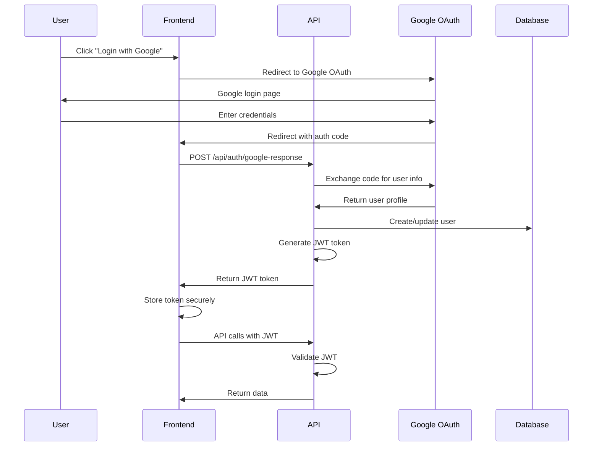
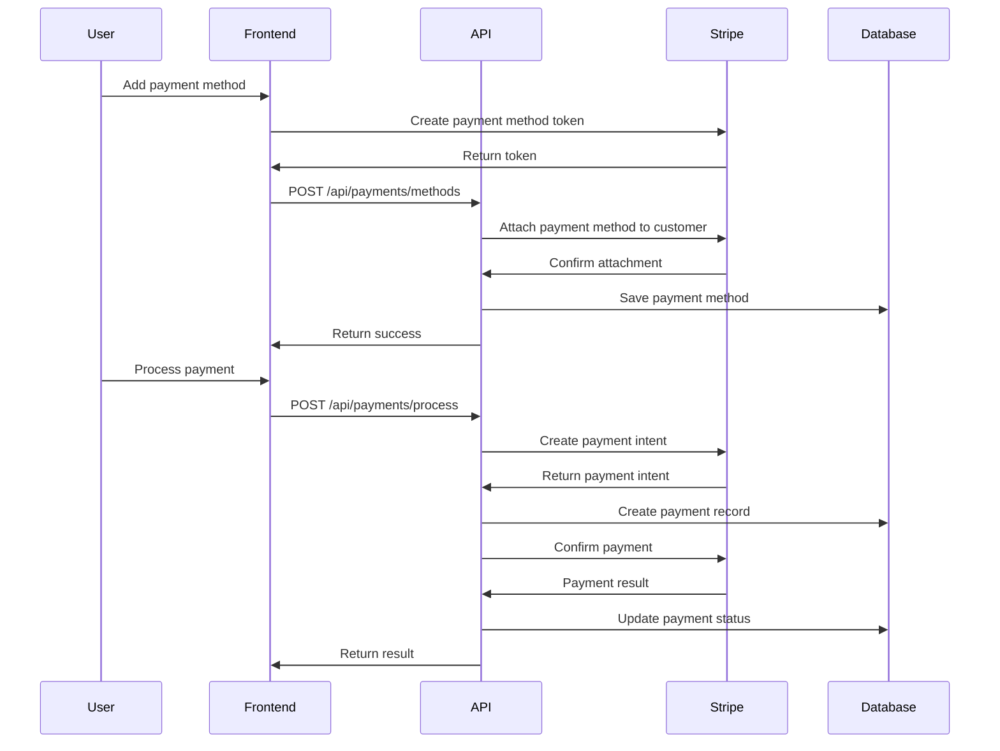

# Enterprise Web Application Framework - Architecture Overview

## System Architecture

This document provides a comprehensive overview of the enterprise web application framework architecture, built with modern technologies and best practices for scalability, maintainability, and security.

## Monorepo Structure

```
Core/
├── src/
│   ├── backend/
│   │   ├── Core.API/              # Web API entry point
│   │   ├── Core.Application/      # CQRS, MediatR handlers, business logic
│   │   ├── Core.Domain/           # Entities, value objects, domain events
│   │   ├── Core.Infrastructure/   # EF Core, external services, Identity
│   │   └── Core.Database/         # SQL DacPac project for PostgreSQL
│   └── frontend/
│       └── src/                   # Vite + React + TypeScript + Tailwind
├── tests/
│   ├── Core.UnitTests/             # NUnit unit tests
│   ├── Core.IntegrationTests/     # NUnit + TestContainers
│   └── Core.E2ETests/              # Playwright E2E tests
├── docker/                        # Docker configurations
├── kubernetes/                     # Kubernetes manifests
└── docs/                          # Documentation
```

## Clean Architecture Implementation

### Core.Domain Layer
**Purpose**: Contains the core business logic and domain entities

**Key Components**:
- **Entities**: `User`, `Payment`, `Subscription`, `PaymentMethod`
- **Value Objects**: `Email`, `Money`, `PaymentStatus`, `SubscriptionStatus`
- **Domain Events**: `UserRegisteredEvent`, `PaymentProcessedEvent`, `SubscriptionCreatedEvent`
- **Interfaces**: `IAggregateRoot`, `IDomainEvent`, `IEntity<TId>`

**Principles**:
- No external dependencies
- Pure business logic
- Rich domain models with behavior

### Core.Application Layer
**Purpose**: Contains application-specific business rules and use cases

**Key Components**:
- **Commands**: `RegisterUserCommand`, `ProcessPaymentCommand`, `CreateSubscriptionCommand`
- **Queries**: `GetUserByIdQuery`, `GetPaymentHistoryQuery`
- **Handlers**: MediatR command/query handlers
- **Validators**: FluentValidation rules
- **DTOs**: Data transfer objects for API communication
- **Interfaces**: `ICurrentUserService`, `IDateTime`, `IPaymentService`

**Principles**:
- Independent of external frameworks
- Use cases orchestrate domain entities
- CQRS pattern implementation

### Core.Infrastructure Layer
**Purpose**: Contains implementations of external concerns

**Key Components**:
- **Persistence**: Entity Framework Core with PostgreSQL
- **External Services**: Stripe payment processing, email services
- **Identity**: ASP.NET Core Identity integration
- **Configuration**: Application settings and secrets management

**Principles**:
- Implements interfaces defined in Application layer
- Handles external dependencies
- Database access and external API calls

### Core.API Layer
**Purpose**: Web API entry point and HTTP concerns

**Key Components**:
- **Controllers**: RESTful API endpoints
- **Middleware**: Authentication, authorization, exception handling
- **Configuration**: Dependency injection, Swagger documentation
- **Authentication**: JWT tokens, Google OAuth integration

**Principles**:
- Thin layer focused on HTTP concerns
- Delegates business logic to Application layer
- Handles request/response formatting

## Technology Stack

### Backend Technologies
- **Framework**: ASP.NET Core 9.0
- **Database**: PostgreSQL with Entity Framework Core
- **Authentication**: ASP.NET Core Identity + Google OAuth + JWT
- **Architecture**: Clean Architecture + CQRS (MediatR)
- **Validation**: FluentValidation
- **Mapping**: AutoMapper
- **Logging**: Serilog
- **Documentation**: Swagger/OpenAPI
- **Payments**: Stripe.NET SDK

### Frontend Technologies
- **Framework**: React 18 with TypeScript
- **Build Tool**: Vite
- **Styling**: Tailwind CSS
- **Routing**: React Router
- **State Management**: React Context + TanStack Query
- **Forms**: React Hook Form + Zod validation
- **UI Components**: Custom component library
- **Payments**: Stripe.js + React Stripe.js

### Infrastructure Technologies
- **Containerization**: Docker
- **Orchestration**: Kubernetes (EKS/AKS/GKE)
- **Database**: PostgreSQL (RDS)
- **Caching**: Redis
- **Search**: Elasticsearch
- **Message Queue**: Apache Kafka
- **Monitoring**: OpenTelemetry + Grafana Stack
- **Infrastructure as Code**: Terraform

## Authentication & Authorization Flow



## Payment Processing Flow



## Database Schema Design

### Core Tables
- **Users**: User profiles and authentication data
- **Payments**: Payment transactions and history
- **Subscriptions**: Recurring subscription data
- **PaymentMethods**: Stored payment methods
- **AuditLogs**: Change tracking and compliance

### Key Relationships
- Users have many Payments and Subscriptions
- Payments belong to Users and PaymentMethods
- Subscriptions belong to Users
- PaymentMethods belong to Users

## API Design Principles

### RESTful Endpoints
- **Authentication**: `/api/auth/*`
- **Users**: `/api/users/*`
- **Payments**: `/api/payments/*`
- **Subscriptions**: `/api/subscriptions/*`
- **Webhooks**: `/api/webhooks/*`

### Response Format
```json
{
  "data": {},
  "success": true,
  "message": "Operation completed successfully",
  "errors": []
}
```

### Error Handling
- Consistent error response format
- HTTP status codes aligned with REST conventions
- Detailed error messages for development
- Sanitized errors for production

## Security Considerations

### Authentication Security
- JWT tokens with short expiration
- Refresh token rotation
- Secure token storage (httpOnly cookies)
- Google OAuth 2.0 integration

### Authorization Security
- Role-based access control
- Policy-based authorization
- Resource-level permissions
- API rate limiting

### Data Security
- HTTPS enforcement
- SQL injection prevention
- XSS protection
- CSRF protection
- Input validation
- Secure headers (HSTS, CSP)

## Scalability Considerations

### Horizontal Scaling
- Stateless API design
- Load balancer ready
- Database connection pooling
- Caching strategies

### Performance Optimization
- Database indexing
- Query optimization
- Response compression
- CDN integration
- Lazy loading

### Monitoring & Observability
- OpenTelemetry integration
- Distributed tracing
- Metrics collection
- Log aggregation
- Health checks

## Deployment Architecture

### Development Environment
- Docker Compose for local development
- Hot reload for frontend and backend
- Local PostgreSQL database
- Mock external services

### Production Environment
- Kubernetes cluster (EKS)
- Managed PostgreSQL (RDS)
- Auto-scaling pods
- Load balancer with SSL termination
- CDN for static assets

## Testing Strategy

### Unit Tests
- Domain logic testing
- Application service testing
- Mock external dependencies
- 80%+ code coverage target

### Integration Tests
- API endpoint testing
- Database integration
- External service mocking
- TestContainers for real databases

### End-to-End Tests
- Complete user journeys
- Cross-browser testing
- Payment flow validation
- Performance testing

## Development Workflow

### Code Quality
- Pre-commit hooks
- Automated linting
- Code formatting
- Security scanning

### CI/CD Pipeline
- Automated testing
- Build verification
- Security scanning
- Deployment automation
- Rollback capabilities

## Future Enhancements

### Planned Features
- Multi-tenant support
- Advanced analytics
- Real-time notifications
- Mobile applications
- API versioning

### Technology Upgrades
- .NET 10.0 when available
- React 19 features
- Advanced monitoring
- Machine learning integration
- Blockchain integration

## Conclusion

This architecture provides a solid foundation for building scalable, maintainable, and secure enterprise web applications. The Clean Architecture approach ensures separation of concerns, testability, and flexibility for future changes. The technology stack is modern, well-supported, and provides excellent developer experience while maintaining production readiness.

The framework is designed to grow with your business needs while maintaining code quality and system reliability. Regular reviews and updates ensure the architecture remains current with evolving best practices and technology trends.
