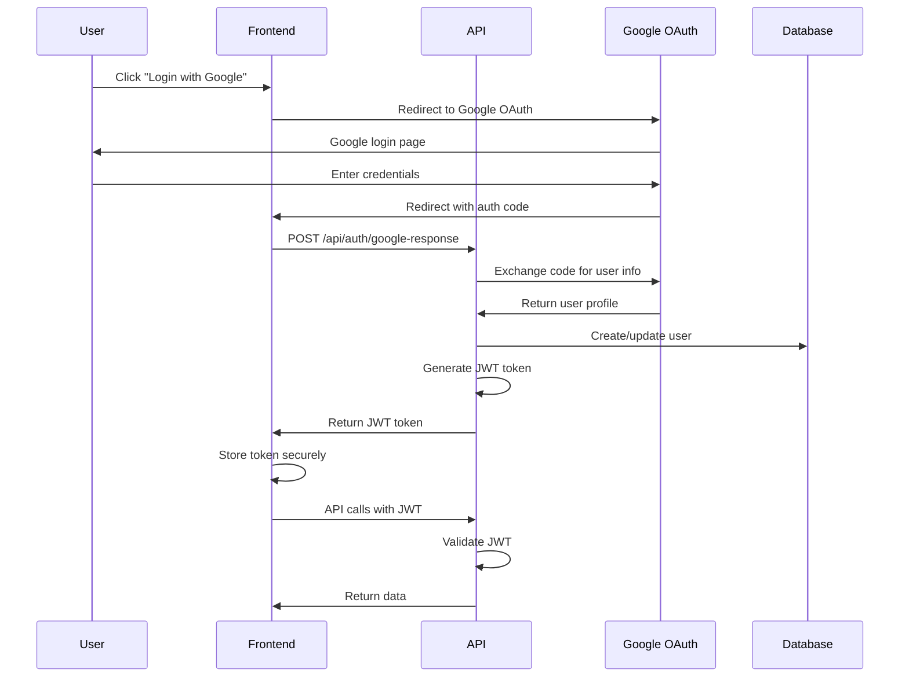

# Authentication Flow Documentation

## Google OAuth + JWT Authentication Flow

### Sequence Diagram



### Authentication Components

#### Frontend Authentication Context
- **AuthContext**: React context for managing authentication state
- **Token Storage**: Secure storage of JWT tokens
- **Route Protection**: Protected route components
- **Token Refresh**: Automatic token refresh logic

#### Backend Authentication Services
- **JWT Service**: Token generation and validation
- **Google OAuth Service**: Google authentication integration
- **Identity Service**: User management and authentication
- **Authorization Policies**: Role-based access control

### API Endpoints

#### Authentication Endpoints
- `GET /api/auth/google-login` - Initiate Google OAuth flow
- `GET /api/auth/google-response` - Handle Google OAuth callback
- `POST /api/auth/refresh` - Refresh JWT token
- `POST /api/auth/logout` - Revoke tokens and logout

#### User Management Endpoints
- `GET /api/users/me` - Get current user profile
- `PUT /api/users/me` - Update user profile
- `GET /api/users` - List users (admin only)
- `PUT /api/users/{id}/role` - Update user role (admin only)

### Security Considerations

#### Token Security
- Short-lived access tokens (15 minutes)
- Refresh token rotation
- Secure token storage (httpOnly cookies)
- Token revocation on logout

#### OAuth Security
- State parameter validation
- PKCE (Proof Key for Code Exchange)
- Secure redirect URIs
- Scope validation

#### Authorization
- Role-based access control
- Policy-based authorization
- Resource-level permissions
- API rate limiting

### Implementation Details

#### JWT Token Structure
```json
{
  "sub": "user-id",
  "email": "user@example.com",
  "roles": ["user"],
  "iat": 1640995200,
  "exp": 1640996100,
  "iss": "https://yourdomain.com",
  "aud": "https://yourdomain.com"
}
```

#### Google OAuth Configuration
```json
{
  "clientId": "your-google-client-id",
  "clientSecret": "your-google-client-secret",
  "redirectUri": "https://yourdomain.com/api/auth/google-response",
  "scopes": ["openid", "email", "profile"]
}
```

### Error Handling

#### Authentication Errors
- Invalid credentials
- Expired tokens
- Insufficient permissions
- Account locked/disabled

#### Error Response Format
```json
{
  "error": "authentication_failed",
  "message": "Invalid or expired token",
  "details": {
    "code": "TOKEN_EXPIRED",
    "timestamp": "2024-01-01T00:00:00Z"
  }
}
```

### Testing Strategy

#### Unit Tests
- JWT token generation and validation
- Google OAuth service mocking
- Authentication middleware testing
- Authorization policy testing

#### Integration Tests
- Complete OAuth flow testing
- Token refresh flow testing
- Protected endpoint access testing
- Error scenario testing

#### End-to-End Tests
- User login flow
- Protected route access
- Token expiration handling
- Logout functionality

### Monitoring and Logging

#### Security Events
- Failed authentication attempts
- Token generation and validation
- OAuth flow completion
- Authorization failures

#### Performance Metrics
- Authentication response times
- Token validation performance
- OAuth flow completion rates
- Error rates by endpoint

### Best Practices

#### Frontend
- Never store sensitive data in localStorage
- Use secure token storage mechanisms
- Implement automatic token refresh
- Handle authentication errors gracefully

#### Backend
- Validate all tokens on every request
- Implement proper error handling
- Log security events
- Use secure random token generation

#### Infrastructure
- Use HTTPS everywhere
- Implement proper CORS policies
- Set secure cookie attributes
- Monitor authentication metrics
