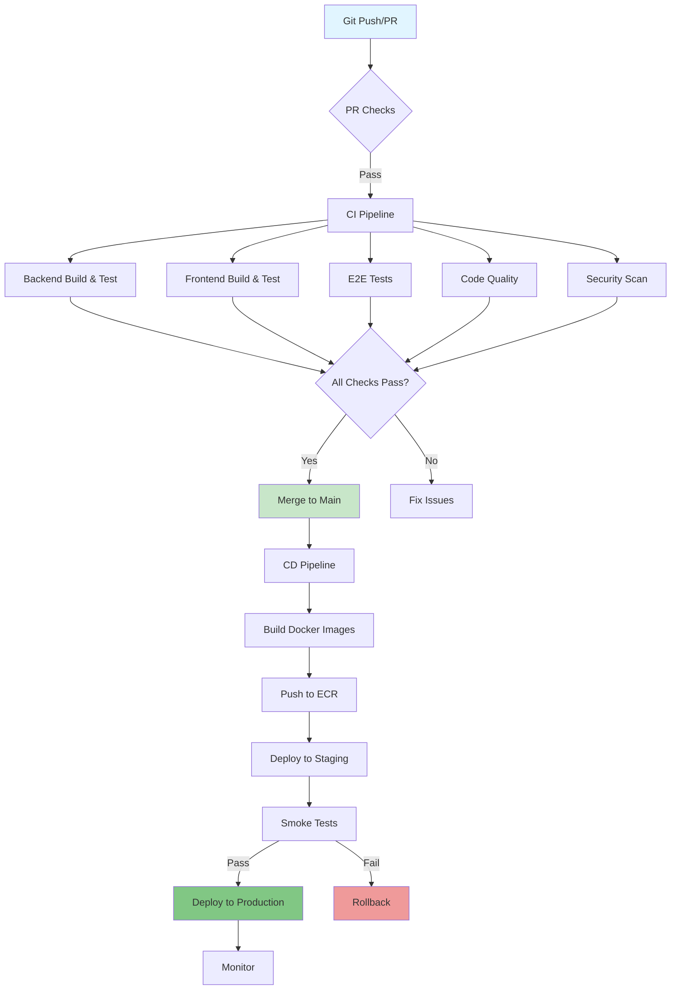
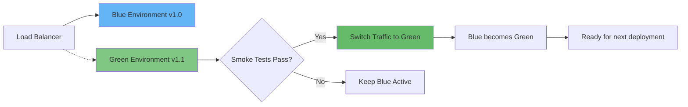

# CI/CD Pipeline Documentation

## Overview

This document describes the Continuous Integration and Continuous Deployment (CI/CD) pipeline for the Core application using GitHub Actions.

## Table of Contents

1. [Pipeline Architecture](#pipeline-architecture)
2. [CI Pipeline](#ci-pipeline)
3. [CD Pipeline](#cd-pipeline)
4. [PR Checks](#pr-checks)
5. [Dependency Management](#dependency-management)
6. [Secrets Configuration](#secrets-configuration)
7. [Deployment Strategy](#deployment-strategy)
8. [Monitoring and Rollback](#monitoring-and-rollback)

## Pipeline Architecture



## CI Pipeline

The CI pipeline runs on every push and pull request to `main` and `develop` branches.

### Jobs

#### 1. Backend Build & Test

**Purpose**: Build and test the .NET backend

**Steps**:
1. Checkout code
2. Setup .NET 9.0
3. Restore NuGet dependencies
4. Build backend (Release configuration)
5. Run unit tests with code coverage
6. Run integration tests
7. Upload test results

**Services**:
- PostgreSQL 16 (port 5433)
- Redis 7 (port 6380)

**Artifacts**:
- Unit test results (`*.trx`)
- Integration test results (`*.trx`)
- Code coverage reports

#### 2. Frontend Build & Test

**Purpose**: Build and test the React frontend

**Steps**:
1. Checkout code
2. Setup Node.js 18
3. Install npm dependencies (cached)
4. Run ESLint
5. Check code formatting (Prettier)
6. Type check (TypeScript)
7. Build production bundle
8. Upload build artifacts

**Artifacts**:
- Frontend build (`dist/`)

#### 3. E2E Tests

**Purpose**: Run end-to-end tests with Playwright

**Dependencies**: Requires `backend` and `frontend` jobs to complete

**Steps**:
1. Checkout code
2. Setup Node.js 18
3. Start Docker services (`docker-compose up`)
4. Wait for services to be healthy
5. Install Playwright dependencies
6. Run E2E tests
7. Upload test reports and screenshots
8. Teardown Docker services

**Artifacts**:
- Playwright HTML report
- Test results and screenshots (on failure)

#### 4. Code Quality

**Purpose**: Analyze code quality and maintainability

**Steps**:
1. Checkout code
2. Setup .NET
3. Build for analysis
4. (Optional) Run SonarCloud scan

#### 5. Docker Build

**Purpose**: Validate Docker images can be built

**Dependencies**: Requires `backend` and `frontend` jobs

**Steps**:
1. Checkout code
2. Setup Docker Buildx
3. Build backend Docker image (no push)
4. Build frontend Docker image (no push)

**Cache**: Uses GitHub Actions cache for layer caching

#### 6. Security Scan

**Purpose**: Scan for security vulnerabilities

**Steps**:
1. Checkout code
2. Run Trivy filesystem scan
3. Upload results to GitHub Security
4. Check for .NET vulnerabilities (`dotnet list package --vulnerable`)
5. Check for npm vulnerabilities (`npm audit`)

**Severity Levels**:
- Critical: Block deployment
- High: Create issue
- Medium: Warn
- Low: Log only

#### 7. Deployment Status

**Purpose**: Report overall pipeline status

**Condition**: Runs only on `main` branch after all checks pass

**Output**:
- Test results summary
- Security scan summary
- Docker build status
- Deployment readiness indicator

### Workflow File

Location: `.github/workflows/ci.yml`

## CD Pipeline

The CD pipeline is manually triggered via `workflow_dispatch` for controlled deployments.

### Trigger

```yaml
on:
  workflow_dispatch:
    inputs:
      environment:
        type: choice
        options:
          - staging
          - production
      version:
        type: string
        description: 'Version to deploy (e.g., v1.0.0)'
```

### Jobs

#### 1. Build & Push Images

**Purpose**: Build and push Docker images to Amazon ECR

**Steps**:
1. Checkout code
2. Configure AWS credentials
3. Login to Amazon ECR
4. Build and tag backend image
5. Build and tag frontend image
6. Push images to ECR

**Tags**:
- `{version}` (e.g., `v1.0.0`)
- `latest`

**Outputs**:
- `backend-image`: Full ECR image URI
- `frontend-image`: Full ECR image URI

#### 2. Deploy to Kubernetes

**Purpose**: Deploy application to EKS cluster

**Dependencies**: Requires `build-and-push` job

**Steps**:
1. Checkout code
2. Configure AWS credentials
3. Update kubeconfig for EKS
4. Setup Terraform
5. Apply Terraform changes
6. Update Kubernetes deployments
7. Wait for rollout completion
8. Run database migrations
9. Verify deployment

**Terraform Variables**:
- `environment`: staging/production
- `backend_image`: ECR image URI
- `frontend_image`: ECR image URI

**Kubernetes Commands**:
```bash
kubectl set image deployment/core-backend \
  core-backend={backend-image} \
  -n core-{environment}

kubectl rollout status deployment/core-backend \
  -n core-{environment} --timeout=5m
```

#### 3. Smoke Tests

**Purpose**: Run critical E2E tests against deployed environment

**Dependencies**: Requires `deploy` job

**Steps**:
1. Checkout code
2. Setup Node.js
3. Install Playwright
4. Run subset of E2E tests (auth + navigation)
5. Run health check on deployed API

**Environment Variables**:
- `BASE_URL`: Frontend URL
- `API_URL`: Backend API URL

#### 4. Notify Deployment

**Purpose**: Send deployment notifications

**Condition**: Always runs after deployment attempt

**Notifications**:
- ✅ Success: Environment, version, timestamp
- ❌ Failure: Error details, logs, team mention

**Integration**: Slack, email, or other notification services

#### 5. Rollback

**Purpose**: Automatic rollback on failure

**Condition**: Runs if `deploy` or `smoke-tests` fail

**Steps**:
1. Configure AWS credentials
2. Update kubeconfig
3. Rollback Kubernetes deployments
4. Wait for rollback completion
5. Verify rollback health

**Rollback Command**:
```bash
kubectl rollout undo deployment/core-backend \
  -n core-{environment}
```

### Workflow File

Location: `.github/workflows/cd.yml`

## PR Checks

Automated checks that run on every pull request.

### 1. PR Title Validation

**Purpose**: Enforce conventional commit format

**Format**: `<type>(<scope>): <subject>`

**Valid Types**:
- `feat`: New feature
- `fix`: Bug fix
- `docs`: Documentation changes
- `style`: Code style changes
- `refactor`: Code refactoring
- `perf`: Performance improvements
- `test`: Test changes
- `build`: Build system changes
- `ci`: CI/CD changes
- `chore`: Maintenance tasks
- `revert`: Revert previous commit

**Example**: `feat(backend): add payment processing API`

### 2. PR Size Check

**Purpose**: Encourage small, reviewable PRs

**Size Labels**:
- `size/XS`: < 100 lines
- `size/S`: 100-299 lines
- `size/M`: 300-499 lines
- `size/L`: 500-999 lines
- `size/XL`: 1000+ lines (requires justification)

### 3. Lint Check

**Purpose**: Enforce code style consistency

**Frontend**:
- ESLint
- Prettier
- TypeScript type checking

### 4. Test Coverage

**Purpose**: Track code coverage

**Minimum Coverage**: 80%

**Integration**: Codecov for coverage reports

### 5. Breaking Changes Detection

**Purpose**: Identify API-breaking changes

**Keywords**:
- "breaking"
- "breaking change"
- "migration required"
- "api change"
- "incompatible"

**Label**: `breaking-change`

### Workflow File

Location: `.github/workflows/pr-checks.yml`

## Dependency Management

Automated dependency updates using Dependabot.

### Configuration

Location: `.github/dependabot.yml`

### Update Schedule

**Weekly** (Mondays at 9:00 AM):
- .NET NuGet packages (Backend)
- npm packages (Frontend)
- npm packages (E2E Tests)
- GitHub Actions
- Docker base images

### Limits

- Backend: 10 open PRs max
- Frontend: 10 open PRs max
- Tests: 5 open PRs max
- Actions: 5 open PRs max

### Ignored Updates

- React major versions (manual review required)
- React DOM major versions (manual review required)

### Labels

PRs are automatically labeled:
- `dependencies`
- `backend` / `frontend` / `testing` / `ci-cd`
- `dotnet` / `npm` / `github-actions` / `docker`

### Reviewers

- `mwhayford`

## Secrets Configuration

### Required Secrets

#### AWS

- `AWS_ACCESS_KEY_ID`: AWS access key
- `AWS_SECRET_ACCESS_KEY`: AWS secret key
- `AWS_REGION`: AWS region (default: us-east-1)
- `EKS_CLUSTER_NAME`: EKS cluster name

#### Application

- `DATABASE_CONNECTION_STRING`: PostgreSQL connection string
- `REDIS_CONNECTION_STRING`: Redis connection string
- `JWT_SECRET_KEY`: JWT signing key
- `GOOGLE_CLIENT_ID`: Google OAuth client ID
- `GOOGLE_CLIENT_SECRET`: Google OAuth client secret
- `STRIPE_SECRET_KEY`: Stripe API secret key
- `STRIPE_PUBLISHABLE_KEY`: Stripe publishable key

#### External Services

- `ELASTICSEARCH_URL`: Elasticsearch endpoint
- `KAFKA_BOOTSTRAP_SERVERS`: Kafka brokers
- `JAEGER_ENDPOINT`: Jaeger collector endpoint

#### Deployment

- `APP_URL`: Frontend application URL
- `API_URL`: Backend API URL

#### Optional

- `SONAR_TOKEN`: SonarCloud token
- `CODECOV_TOKEN`: Codecov token
- `SLACK_WEBHOOK_URL`: Slack notifications

### Environment-Specific Secrets

Secrets are organized by environment:

**Staging**:
- `STAGING_DATABASE_URL`
- `STAGING_REDIS_URL`
- `STAGING_APP_URL`

**Production**:
- `PRODUCTION_DATABASE_URL`
- `PRODUCTION_REDIS_URL`
- `PRODUCTION_APP_URL`

### Secret Rotation

- **Frequency**: Quarterly
- **Process**: Automated via AWS Secrets Manager
- **Notification**: Team notified 7 days before rotation

## Deployment Strategy

### Blue-Green Deployment



**Benefits**:
- Zero-downtime deployments
- Easy rollback
- Smoke testing before cutover

### Canary Deployment

For high-risk changes:

1. Deploy to 5% of traffic
2. Monitor for 15 minutes
3. If healthy, increase to 25%
4. Monitor for 15 minutes
5. If healthy, increase to 50%
6. Monitor for 15 minutes
7. If healthy, complete rollout to 100%

**Abort Conditions**:
- Error rate > 1%
- Latency increase > 20%
- Memory/CPU spike > 80%

### Database Migrations

**Strategy**: Forward-only migrations

**Process**:
1. Deploy backward-compatible schema changes
2. Deploy application code
3. Remove deprecated schema (next release)

**Rollback**: Schema changes are NOT rolled back automatically

## Monitoring and Rollback

### Health Checks

**Endpoints**:
- `/health`: Basic health check
- `/health/ready`: Readiness check (dependencies)
- `/health/live`: Liveness check

**Kubernetes Probes**:
```yaml
livenessProbe:
  httpGet:
    path: /health/live
    port: 80
  initialDelaySeconds: 30
  periodSeconds: 10

readinessProbe:
  httpGet:
    path: /health/ready
    port: 80
  initialDelaySeconds: 5
  periodSeconds: 5
```

### Metrics

**Monitored via Grafana**:
- Request rate
- Error rate
- Response time (p50, p95, p99)
- CPU and memory usage
- Database connection pool
- Cache hit ratio

**Alerts**:
- Error rate > 1%: Warning
- Error rate > 5%: Critical
- Response time p95 > 1s: Warning
- Response time p95 > 3s: Critical

### Automatic Rollback

**Triggers**:
- Smoke tests fail
- Health checks fail for 2 minutes
- Error rate > 5% for 5 minutes
- Critical metrics breached

**Process**:
1. Alert team
2. Stop new deployments
3. Execute rollback
4. Verify rolled-back version
5. Post-mortem analysis

### Manual Rollback

**Via GitHub Actions**:
```bash
# Trigger CD pipeline with previous version
gh workflow run cd.yml \
  -f environment=production \
  -f version=v1.0.0
```

**Via kubectl**:
```bash
kubectl rollout undo deployment/core-backend \
  -n core-production
```

## Best Practices

### 1. Small, Frequent Deployments

- Deploy multiple times per day
- Keep changes small and focused
- Use feature flags for incomplete features

### 2. Test in Production-Like Environments

- Staging mirrors production
- Use production-scale data
- Test with production traffic patterns

### 3. Monitor Everything

- Application metrics
- Infrastructure metrics
- Business metrics
- User experience metrics

### 4. Automate Rollbacks

- Define clear failure criteria
- Automate rollback process
- Test rollback regularly

### 5. Document Incidents

- Post-mortem for all production issues
- Share learnings
- Update runbooks

## Troubleshooting

### CI Pipeline Failures

#### Build Failures

**Symptom**: Build fails during compilation

**Common Causes**:
- Missing dependencies
- Syntax errors
- Breaking changes

**Resolution**:
1. Check build logs
2. Verify dependencies are up to date
3. Run build locally
4. Fix errors and push

#### Test Failures

**Symptom**: Tests fail during CI run

**Common Causes**:
- Flaky tests
- Environment differences
- Data dependencies

**Resolution**:
1. Reproduce locally
2. Check test logs
3. Fix test or code
4. Re-run pipeline

#### E2E Test Failures

**Symptom**: Playwright tests timeout or fail

**Common Causes**:
- Services not ready
- Network issues
- Selector changes

**Resolution**:
1. Check service health logs
2. Review Playwright screenshots
3. Increase timeouts if needed
4. Fix selectors or waits

### CD Pipeline Failures

#### Deployment Failures

**Symptom**: Kubernetes deployment fails

**Common Causes**:
- Image pull errors
- Resource limits
- Configuration errors

**Resolution**:
1. Check pod logs: `kubectl logs`
2. Describe pod: `kubectl describe pod`
3. Verify image exists in ECR
4. Check resource quotas

#### Rollback Issues

**Symptom**: Rollback fails to restore service

**Common Causes**:
- Database migration incompatibility
- Shared state issues
- Configuration drift

**Resolution**:
1. Check previous deployment logs
2. Manually verify database state
3. Check configuration consistency
4. Contact on-call engineer

## Resources

- [GitHub Actions Documentation](https://docs.github.com/en/actions)
- [Kubernetes Documentation](https://kubernetes.io/docs/)
- [Terraform Documentation](https://www.terraform.io/docs)
- [AWS EKS Best Practices](https://aws.github.io/aws-eks-best-practices/)
- [Dependabot Documentation](https://docs.github.com/en/code-security/dependabot)

