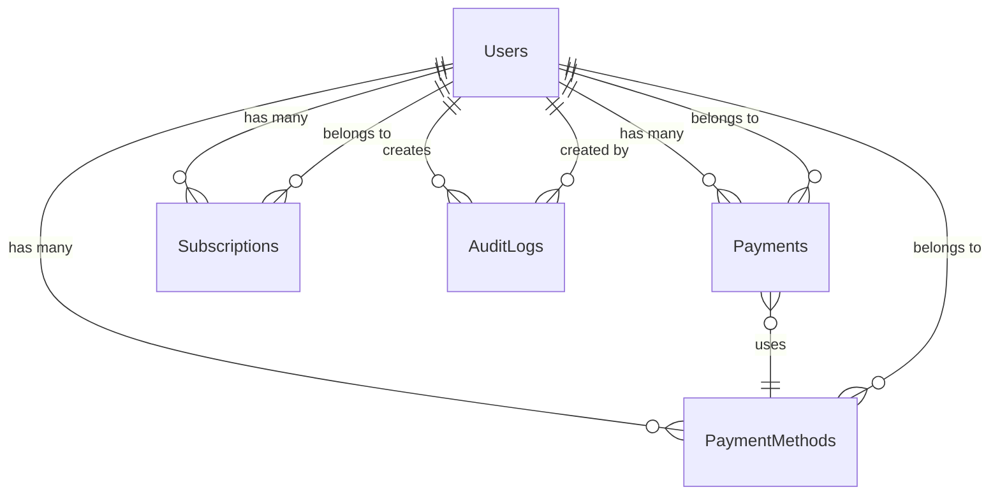

# Database Schema Documentation

## Overview

This document describes the database schema for the Enterprise Web Application Framework. The database uses PostgreSQL and follows a relational design optimized for the Clean Architecture implementation.

## Database Design Principles

- **Normalization**: Properly normalized to reduce redundancy
- **Referential Integrity**: Foreign key constraints ensure data consistency
- **Audit Trail**: Comprehensive tracking of changes and user actions
- **Performance**: Optimized indexes for common query patterns
- **Security**: Sensitive data encryption and access controls

## Entity Relationship Diagram



## Tables

### Users Table

Stores user account information and authentication data.

```sql
CREATE TABLE Users (
    Id UUID PRIMARY KEY DEFAULT gen_random_uuid(),
    Email VARCHAR(256) NOT NULL UNIQUE,
    FirstName VARCHAR(100) NOT NULL,
    LastName VARCHAR(100) NOT NULL,
    DisplayName VARCHAR(200),
    AvatarUrl VARCHAR(500),
    ExternalId VARCHAR(256) NOT NULL UNIQUE, -- ASP.NET Core Identity User ID
    StripeCustomerId VARCHAR(256) UNIQUE,
    IsActive BOOLEAN NOT NULL DEFAULT true,
    CreatedAt TIMESTAMP WITH TIME ZONE NOT NULL DEFAULT NOW(),
    UpdatedAt TIMESTAMP WITH TIME ZONE NOT NULL DEFAULT NOW()
);
```

**Indexes:**
```sql
CREATE INDEX IX_Users_Email ON Users(Email);
CREATE INDEX IX_Users_ExternalId ON Users(ExternalId);
CREATE INDEX IX_Users_StripeCustomerId ON Users(StripeCustomerId);
CREATE INDEX IX_Users_CreatedAt ON Users(CreatedAt);
```

**Constraints:**
- Email must be valid format
- ExternalId cannot be null
- CreatedAt and UpdatedAt are automatically managed

### Payments Table

Stores payment transaction records and history.

```sql
CREATE TABLE Payments (
    Id UUID PRIMARY KEY DEFAULT gen_random_uuid(),
    UserId UUID NOT NULL,
    Amount DECIMAL(18,2) NOT NULL,
    Currency VARCHAR(3) NOT NULL DEFAULT 'USD',
    Status VARCHAR(50) NOT NULL,
    PaymentMethodType VARCHAR(50) NOT NULL,
    StripePaymentIntentId VARCHAR(256),
    StripeChargeId VARCHAR(256),
    Description VARCHAR(500),
    FailureReason VARCHAR(1000),
    ProcessedAt TIMESTAMP WITH TIME ZONE,
    CreatedAt TIMESTAMP WITH TIME ZONE NOT NULL DEFAULT NOW(),
    UpdatedAt TIMESTAMP WITH TIME ZONE NOT NULL DEFAULT NOW(),
    
    CONSTRAINT FK_Payments_Users FOREIGN KEY (UserId) REFERENCES Users(Id) ON DELETE RESTRICT,
    CONSTRAINT CK_Payments_Amount CHECK (Amount > 0),
    CONSTRAINT CK_Payments_Status CHECK (Status IN ('Pending', 'Processing', 'Succeeded', 'Failed', 'Cancelled', 'Refunded', 'PartiallyRefunded'))
);
```

**Indexes:**
```sql
CREATE INDEX IX_Payments_UserId ON Payments(UserId);
CREATE INDEX IX_Payments_Status ON Payments(Status);
CREATE INDEX IX_Payments_CreatedAt ON Payments(CreatedAt);
CREATE INDEX IX_Payments_StripePaymentIntentId ON Payments(StripePaymentIntentId);
CREATE INDEX IX_Payments_ProcessedAt ON Payments(ProcessedAt);
```

**Constraints:**
- Amount must be positive
- Status must be valid enum value
- UserId must reference existing user

### Subscriptions Table

Stores subscription information and billing cycles.

```sql
CREATE TABLE Subscriptions (
    Id UUID PRIMARY KEY DEFAULT gen_random_uuid(),
    UserId UUID NOT NULL,
    PlanId VARCHAR(100) NOT NULL,
    Amount DECIMAL(18,2) NOT NULL,
    Currency VARCHAR(3) NOT NULL DEFAULT 'USD',
    Status VARCHAR(50) NOT NULL,
    StripeSubscriptionId VARCHAR(256) UNIQUE,
    StripeCustomerId VARCHAR(256),
    CurrentPeriodStart TIMESTAMP WITH TIME ZONE,
    CurrentPeriodEnd TIMESTAMP WITH TIME ZONE,
    TrialStart TIMESTAMP WITH TIME ZONE,
    TrialEnd TIMESTAMP WITH TIME ZONE,
    CanceledAt TIMESTAMP WITH TIME ZONE,
    CreatedAt TIMESTAMP WITH TIME ZONE NOT NULL DEFAULT NOW(),
    UpdatedAt TIMESTAMP WITH TIME ZONE NOT NULL DEFAULT NOW(),
    
    CONSTRAINT FK_Subscriptions_Users FOREIGN KEY (UserId) REFERENCES Users(Id) ON DELETE RESTRICT,
    CONSTRAINT CK_Subscriptions_Amount CHECK (Amount > 0),
    CONSTRAINT CK_Subscriptions_Status CHECK (Status IN ('Incomplete', 'IncompleteExpired', 'Trialing', 'Active', 'PastDue', 'Canceled', 'Unpaid', 'Paused'))
);
```

**Indexes:**
```sql
CREATE INDEX IX_Subscriptions_UserId ON Subscriptions(UserId);
CREATE INDEX IX_Subscriptions_Status ON Subscriptions(Status);
CREATE INDEX IX_Subscriptions_StripeSubscriptionId ON Subscriptions(StripeSubscriptionId);
CREATE INDEX IX_Subscriptions_CurrentPeriodEnd ON Subscriptions(CurrentPeriodEnd);
CREATE INDEX IX_Subscriptions_CreatedAt ON Subscriptions(CreatedAt);
```

**Constraints:**
- Amount must be positive
- Status must be valid enum value
- UserId must reference existing user

### PaymentMethods Table

Stores user payment methods for recurring payments.

```sql
CREATE TABLE PaymentMethods (
    Id UUID PRIMARY KEY DEFAULT gen_random_uuid(),
    UserId UUID NOT NULL,
    Type VARCHAR(50) NOT NULL,
    LastFour VARCHAR(4),
    ExternalId VARCHAR(256) NOT NULL UNIQUE, -- Stripe PaymentMethod ID
    IsDefault BOOLEAN NOT NULL DEFAULT false,
    IsActive BOOLEAN NOT NULL DEFAULT true,
    CreatedAt TIMESTAMP WITH TIME ZONE NOT NULL DEFAULT NOW(),
    UpdatedAt TIMESTAMP WITH TIME ZONE NOT NULL DEFAULT NOW(),
    
    CONSTRAINT FK_PaymentMethods_Users FOREIGN KEY (UserId) REFERENCES Users(Id) ON DELETE RESTRICT,
    CONSTRAINT CK_PaymentMethods_Type CHECK (Type IN ('Card', 'Ach', 'BankTransfer', 'Cash'))
);
```

**Indexes:**
```sql
CREATE INDEX IX_PaymentMethods_UserId ON PaymentMethods(UserId);
CREATE INDEX IX_PaymentMethods_ExternalId ON PaymentMethods(ExternalId);
CREATE INDEX IX_PaymentMethods_IsDefault ON PaymentMethods(IsDefault);
CREATE INDEX IX_PaymentMethods_IsActive ON PaymentMethods(IsActive);
```

**Constraints:**
- Type must be valid enum value
- ExternalId must be unique
- UserId must reference existing user

### AuditLogs Table

Stores audit trail information for compliance and tracking.

```sql
CREATE TABLE AuditLogs (
    Id UUID PRIMARY KEY DEFAULT gen_random_uuid(),
    UserId UUID,
    EntityType VARCHAR(100) NOT NULL,
    EntityId UUID NOT NULL,
    Action VARCHAR(50) NOT NULL,
    OldValues JSONB,
    NewValues JSONB,
    IpAddress INET,
    UserAgent VARCHAR(1000),
    CreatedAt TIMESTAMP WITH TIME ZONE NOT NULL DEFAULT NOW(),
    
    CONSTRAINT FK_AuditLogs_Users FOREIGN KEY (UserId) REFERENCES Users(Id) ON DELETE SET NULL,
    CONSTRAINT CK_AuditLogs_Action CHECK (Action IN ('Create', 'Update', 'Delete', 'Login', 'Logout', 'Payment', 'Subscription'))
);
```

**Indexes:**
```sql
CREATE INDEX IX_AuditLogs_UserId ON AuditLogs(UserId);
CREATE INDEX IX_AuditLogs_EntityType ON AuditLogs(EntityType);
CREATE INDEX IX_AuditLogs_EntityId ON AuditLogs(EntityId);
CREATE INDEX IX_AuditLogs_Action ON AuditLogs(Action);
CREATE INDEX IX_AuditLogs_CreatedAt ON AuditLogs(CreatedAt);
```

**Constraints:**
- Action must be valid enum value
- EntityType and EntityId are required

## Data Types and Enums

### Payment Status Enum
```sql
CREATE TYPE PaymentStatus AS ENUM (
    'Pending',
    'Processing', 
    'Succeeded',
    'Failed',
    'Cancelled',
    'Refunded',
    'PartiallyRefunded'
);
```

### Subscription Status Enum
```sql
CREATE TYPE SubscriptionStatus AS ENUM (
    'Incomplete',
    'IncompleteExpired',
    'Trialing',
    'Active',
    'PastDue',
    'Canceled',
    'Unpaid',
    'Paused'
);
```

### Payment Method Type Enum
```sql
CREATE TYPE PaymentMethodType AS ENUM (
    'Card',
    'Ach',
    'BankTransfer',
    'Cash'
);
```

## Stored Procedures

### Update User Timestamp
```sql
CREATE OR REPLACE FUNCTION update_updated_at_column()
RETURNS TRIGGER AS $$
BEGIN
    NEW.UpdatedAt = NOW();
    RETURN NEW;
END;
$$ language 'plpgsql';
```

### Audit Log Trigger
```sql
CREATE OR REPLACE FUNCTION audit_trigger_function()
RETURNS TRIGGER AS $$
BEGIN
    INSERT INTO AuditLogs (
        UserId,
        EntityType,
        EntityId,
        Action,
        OldValues,
        NewValues
    ) VALUES (
        COALESCE(NEW.UserId, OLD.UserId),
        TG_TABLE_NAME,
        COALESCE(NEW.Id, OLD.Id),
        TG_OP,
        CASE WHEN TG_OP = 'DELETE' THEN to_jsonb(OLD) ELSE NULL END,
        CASE WHEN TG_OP = 'INSERT' THEN to_jsonb(NEW) ELSE NULL END
    );
    RETURN COALESCE(NEW, OLD);
END;
$$ language 'plpgsql';
```

## Triggers

### UpdatedAt Triggers
```sql
CREATE TRIGGER update_users_updated_at 
    BEFORE UPDATE ON Users 
    FOR EACH ROW EXECUTE FUNCTION update_updated_at_column();

CREATE TRIGGER update_payments_updated_at 
    BEFORE UPDATE ON Payments 
    FOR EACH ROW EXECUTE FUNCTION update_updated_at_column();

CREATE TRIGGER update_subscriptions_updated_at 
    BEFORE UPDATE ON Subscriptions 
    FOR EACH ROW EXECUTE FUNCTION update_updated_at_column();

CREATE TRIGGER update_paymentmethods_updated_at 
    BEFORE UPDATE ON PaymentMethods 
    FOR EACH ROW EXECUTE FUNCTION update_updated_at_column();
```

### Audit Triggers
```sql
CREATE TRIGGER audit_users_trigger
    AFTER INSERT OR UPDATE OR DELETE ON Users
    FOR EACH ROW EXECUTE FUNCTION audit_trigger_function();

CREATE TRIGGER audit_payments_trigger
    AFTER INSERT OR UPDATE OR DELETE ON Payments
    FOR EACH ROW EXECUTE FUNCTION audit_trigger_function();

CREATE TRIGGER audit_subscriptions_trigger
    AFTER INSERT OR UPDATE OR DELETE ON Subscriptions
    FOR EACH ROW EXECUTE FUNCTION audit_trigger_function();

CREATE TRIGGER audit_paymentmethods_trigger
    AFTER INSERT OR UPDATE OR DELETE ON PaymentMethods
    FOR EACH ROW EXECUTE FUNCTION audit_trigger_function();
```

## Views

### User Payment Summary View
```sql
CREATE VIEW UserPaymentSummary AS
SELECT 
    u.Id as UserId,
    u.Email,
    u.FirstName,
    u.LastName,
    COUNT(p.Id) as TotalPayments,
    SUM(CASE WHEN p.Status = 'Succeeded' THEN p.Amount ELSE 0 END) as TotalAmount,
    MAX(p.CreatedAt) as LastPaymentDate
FROM Users u
LEFT JOIN Payments p ON u.Id = p.UserId
GROUP BY u.Id, u.Email, u.FirstName, u.LastName;
```

### Active Subscriptions View
```sql
CREATE VIEW ActiveSubscriptions AS
SELECT 
    s.Id,
    s.UserId,
    u.Email,
    s.PlanId,
    s.Amount,
    s.Currency,
    s.CurrentPeriodStart,
    s.CurrentPeriodEnd,
    s.CreatedAt
FROM Subscriptions s
JOIN Users u ON s.UserId = u.Id
WHERE s.Status = 'Active';
```

## Performance Optimization

### Query Optimization
- Use appropriate indexes for common query patterns
- Implement query result caching where appropriate
- Use connection pooling for database connections
- Monitor slow queries and optimize as needed

### Indexing Strategy
- Primary keys on all tables
- Foreign key indexes for joins
- Composite indexes for complex queries
- Partial indexes for filtered queries

### Maintenance
- Regular VACUUM and ANALYZE operations
- Monitor table bloat and fragmentation
- Update table statistics regularly
- Implement automated maintenance tasks

## Security Considerations

### Data Encryption
- Encrypt sensitive data at rest
- Use SSL/TLS for data in transit
- Implement field-level encryption for PII
- Regular security audits and penetration testing

### Access Control
- Implement row-level security (RLS) where appropriate
- Use database roles and permissions
- Implement audit logging for all changes
- Regular access reviews and cleanup

### Backup and Recovery
- Regular automated backups
- Test restore procedures regularly
- Implement point-in-time recovery
- Store backups securely offsite

## Migration Strategy

### Version Control
- Use database migration scripts
- Version control all schema changes
- Implement rollback procedures
- Test migrations in staging environment

### Deployment Process
- Run migrations during deployment
- Implement zero-downtime migrations
- Use feature flags for schema changes
- Monitor migration success/failure

## Monitoring and Alerting

### Key Metrics
- Database connection pool usage
- Query performance metrics
- Table size and growth
- Index usage statistics

### Alerts
- High connection pool usage
- Slow query detection
- Database space usage
- Failed migration attempts

## Best Practices

### Development
- Use transactions for data consistency
- Implement proper error handling
- Use parameterized queries to prevent SQL injection
- Test all database operations

### Production
- Monitor database performance
- Implement proper backup procedures
- Use connection pooling
- Regular maintenance and optimization

### Data Management
- Implement data retention policies
- Regular data cleanup procedures
- Implement data archiving strategies
- Monitor data quality and integrity
