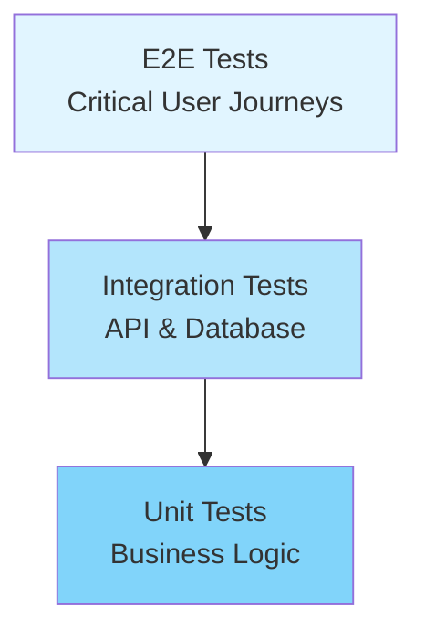
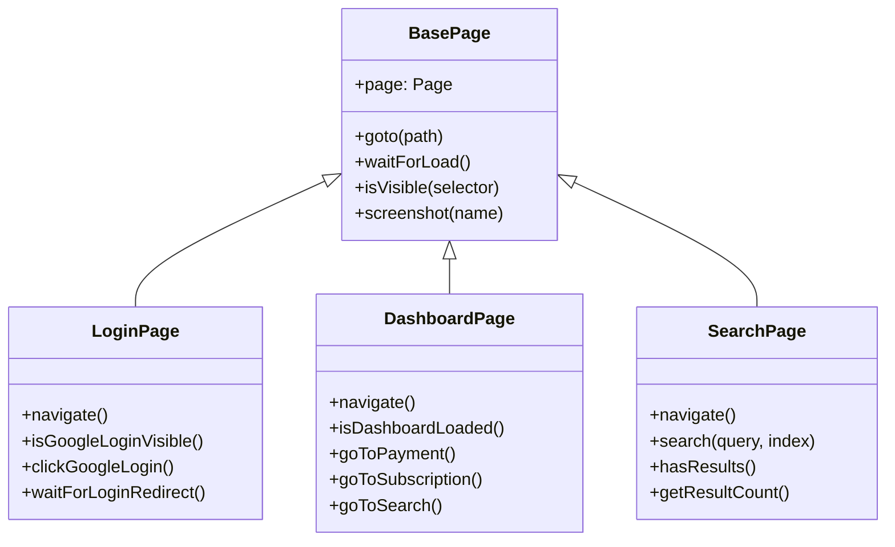

# End-to-End Testing Guide

## Overview

This document describes the end-to-end (E2E) testing strategy for the Core application using Playwright.

## Table of Contents

1. [Architecture](#architecture)
2. [Test Structure](#test-structure)
3. [Setup and Installation](#setup-and-installation)
4. [Running Tests](#running-tests)
5. [Writing Tests](#writing-tests)
6. [Best Practices](#best-practices)
7. [CI/CD Integration](#cicd-integration)
8. [Troubleshooting](#troubleshooting)

## Architecture

### Technology Stack

- **Framework**: Playwright Test
- **Language**: TypeScript
- **Browser**: Chromium (Desktop Chrome)
- **Pattern**: Page Object Model (POM)

### Test Pyramid



E2E tests sit at the top of the test pyramid, covering:
- Complete user workflows
- Cross-system integration
- UI/UX validation
- Real browser behavior

## Test Structure

### Directory Organization

```
tests/Core.E2ETests/
├── tests/
│   ├── fixtures/
│   │   └── auth.fixture.ts       # Authentication fixtures
│   ├── pages/
│   │   ├── BasePage.ts            # Base page class
│   │   ├── LoginPage.ts           # Login page object
│   │   ├── DashboardPage.ts       # Dashboard page object
│   │   └── SearchPage.ts          # Search page object
│   ├── auth.spec.ts               # Authentication tests
│   ├── search.spec.ts             # Search tests
│   ├── payment.spec.ts            # Payment tests
│   ├── subscription.spec.ts       # Subscription tests
│   └── navigation.spec.ts         # Navigation tests
├── playwright.config.ts           # Playwright configuration
├── tsconfig.json                  # TypeScript configuration
├── package.json                   # NPM dependencies and scripts
└── README.md                      # Quick start guide
```

### Page Object Model



## Setup and Installation

### Prerequisites

1. Node.js (v18 or higher)
2. npm or yarn
3. Docker and Docker Compose (for running the application)

### Installation Steps

```bash
# Navigate to E2E tests directory
cd tests/Core.E2ETests

# Install dependencies
npm install

# Install Playwright browsers
npx playwright install chromium

# (Optional) Install system dependencies
npx playwright install-deps chromium
```

### Environment Configuration

Create a `.env` file (optional):

```env
BASE_URL=http://localhost:3001
API_URL=http://localhost:5111
STRIPE_PUBLISHABLE_KEY=pk_test_...
```

## Running Tests

### Local Development

```bash
# Run all tests (headless)
npm test

# Run with browser visible
npm run test:headed

# Run in debug mode (step through tests)
npm run test:debug

# Run with UI mode (interactive)
npm run test:ui
```

### Specific Test Suites

```bash
# Authentication tests
npm run test:auth

# Search functionality
npm run test:search

# Payment processing
npm run test:payment

# Subscription management
npm run test:subscription

# Navigation and routing
npm run test:navigation
```

### View Test Reports

```bash
# Open HTML report
npm run report
```

## Writing Tests

### Basic Test Structure

```typescript
import { test, expect } from './fixtures/auth.fixture';

test.describe('Feature Name', () => {
  test.beforeEach(async ({ authenticatedPage }) => {
    // Setup before each test
    await authenticatedPage.navigate();
  });

  test('should do something', async ({ page }) => {
    // Arrange
    await page.goto('/some-page');

    // Act
    await page.click('button');

    // Assert
    expect(page.url()).toContain('/expected-url');
  });
});
```

### Creating Page Objects

```typescript
// tests/pages/MyPage.ts
import { Page } from '@playwright/test';
import { BasePage } from './BasePage';

export class MyPage extends BasePage {
  private readonly myButton = 'button[data-testid="my-button"]';
  
  constructor(page: Page) {
    super(page);
  }

  async navigate(): Promise<void> {
    await this.goto('/my-page');
    await this.waitForLoad();
  }

  async clickMyButton(): Promise<void> {
    await this.page.click(this.myButton);
  }
}
```

### Using Fixtures

```typescript
// tests/fixtures/my.fixture.ts
import { test as base } from '@playwright/test';
import { MyPage } from '../pages/MyPage';

type MyFixtures = {
  myPage: MyPage;
};

export const test = base.extend<MyFixtures>({
  myPage: async ({ page }, use) => {
    const myPage = new MyPage(page);
    await use(myPage);
  },
});

export { expect } from '@playwright/test';
```

## Best Practices

### 1. Use Meaningful Test Names

```typescript
// ❌ Bad
test('test 1', async () => { ... });

// ✅ Good
test('should display error message when login fails', async () => { ... });
```

### 2. Follow AAA Pattern

```typescript
test('should add item to cart', async ({ page }) => {
  // Arrange
  await page.goto('/products');
  
  // Act
  await page.click('[data-testid="add-to-cart"]');
  
  // Assert
  await expect(page.locator('[data-testid="cart-count"]')).toHaveText('1');
});
```

### 3. Use Auto-Retrying Assertions

```typescript
// ❌ Bad - no retry
const text = await page.textContent('.message');
expect(text).toBe('Success');

// ✅ Good - auto-retries
await expect(page.locator('.message')).toHaveText('Success');
```

### 4. Prefer User-Visible Locators

```typescript
// ❌ Bad - brittle CSS selectors
await page.click('.btn.btn-primary.submit-btn');

// ✅ Good - semantic locators
await page.click('button:has-text("Submit")');
await page.click('[aria-label="Submit form"]');
await page.getByRole('button', { name: 'Submit' }).click();
```

### 5. Avoid Arbitrary Waits

```typescript
// ❌ Bad
await page.waitForTimeout(3000);

// ✅ Good
await page.waitForLoadState('networkidle');
await page.waitForURL('**/dashboard');
await expect(page.locator('.loading')).not.toBeVisible();
```

### 6. Keep Tests Independent

```typescript
// Each test should be able to run in isolation
test.describe('Shopping Cart', () => {
  test.beforeEach(async ({ page }) => {
    // Fresh setup for each test
    await page.goto('/');
    await clearCart(page);
  });

  test('test 1', async ({ page }) => { ... });
  test('test 2', async ({ page }) => { ... });
});
```

### 7. Use Page Objects

```typescript
// ❌ Bad - direct page interactions in tests
test('should login', async ({ page }) => {
  await page.fill('#username', 'user');
  await page.fill('#password', 'pass');
  await page.click('#submit');
});

// ✅ Good - abstracted in page object
test('should login', async ({ loginPage }) => {
  await loginPage.login('user', 'pass');
});
```

### 8. Handle Authentication Properly

```typescript
// Use fixtures for authenticated state
export const test = base.extend<AuthFixtures>({
  authenticatedPage: async ({ page }, use) => {
    // Set up authentication (e.g., tokens, cookies)
    await setupAuth(page);
    const dashboard = new DashboardPage(page);
    await dashboard.navigate();
    await use(dashboard);
  },
});
```

## CI/CD Integration

### GitHub Actions Example

```yaml
name: E2E Tests

on:
  push:
    branches: [main, develop]
  pull_request:
    branches: [main, develop]

jobs:
  e2e-tests:
    runs-on: ubuntu-latest
    
    steps:
      - uses: actions/checkout@v3
      
      - name: Setup Node.js
        uses: actions/setup-node@v3
        with:
          node-version: '18'
      
      - name: Start Docker services
        run: docker-compose up -d
        
      - name: Wait for services
        run: |
          npx wait-on http://localhost:3001
          npx wait-on http://localhost:5111/health
      
      - name: Install E2E test dependencies
        run: |
          cd tests/Core.E2ETests
          npm ci
          npx playwright install chromium --with-deps
      
      - name: Run E2E tests
        run: |
          cd tests/Core.E2ETests
          npm test
        env:
          CI: true
      
      - name: Upload test results
        if: always()
        uses: actions/upload-artifact@v3
        with:
          name: playwright-report
          path: tests/Core.E2ETests/playwright-report/
      
      - name: Upload test artifacts
        if: failure()
        uses: actions/upload-artifact@v3
        with:
          name: test-results
          path: tests/Core.E2ETests/test-results/
```

### Running in Docker

```dockerfile
# Dockerfile.e2e
FROM mcr.microsoft.com/playwright:v1.40.0-jammy

WORKDIR /app

COPY tests/Core.E2ETests/package*.json ./
RUN npm ci

COPY tests/Core.E2ETests/ ./

CMD ["npm", "test"]
```

## Troubleshooting

### Common Issues

#### 1. Tests Timeout

**Problem**: Tests fail with timeout errors.

**Solutions**:
- Increase timeout in `playwright.config.ts`
- Check if Docker containers are running
- Verify network connectivity
- Use explicit waits instead of arbitrary timeouts

#### 2. Flaky Tests

**Problem**: Tests pass/fail inconsistently.

**Solutions**:
- Add explicit waits for dynamic content
- Use `waitForLoadState('networkidle')`
- Check for race conditions
- Avoid using `waitForTimeout()`

#### 3. Element Not Found

**Problem**: Locators cannot find elements.

**Solutions**:
- Wait for element to be visible
- Check if element is in an iframe
- Verify selector accuracy
- Use Playwright Inspector to debug

```bash
# Debug with Inspector
npm run test:debug
```

#### 4. Authentication Issues

**Problem**: Tests fail on protected routes.

**Solutions**:
- Verify authentication tokens are set correctly
- Check token expiration
- Ensure cookies/localStorage persist across navigations
- Use authentication fixtures

#### 5. Stripe Elements Not Loading

**Problem**: Payment forms don't render Stripe Elements.

**Solutions**:
- Set `VITE_STRIPE_PUBLISHABLE_KEY` environment variable
- Use Stripe test keys (`pk_test_...`)
- Check browser console for Stripe errors
- Verify iframe loading

### Debugging Techniques

#### Visual Debugging

```bash
# Run tests with browser visible
npm run test:headed

# Run in debug mode
npm run test:debug
```

#### Screenshots and Videos

```typescript
// Take screenshot
await page.screenshot({ path: 'debug.png' });

// In config
use: {
  screenshot: 'only-on-failure',
  video: 'retain-on-failure',
}
```

#### Traces

```typescript
// In config
use: {
  trace: 'on-first-retry',
}

// View trace
npx playwright show-trace test-results/trace.zip
```

#### Console Logs

```typescript
// Listen to console messages
page.on('console', msg => console.log(msg.text()));

// Listen to page errors
page.on('pageerror', err => console.log(err.message));
```

## Test Coverage Matrix

| Feature | Auth | Search | Payment | Subscription | Navigation |
|---------|------|--------|---------|--------------|------------|
| **Login Flow** | ✅ | | | | |
| **Google OAuth** | ✅ | | | | |
| **Session Persistence** | ✅ | | | | ✅ |
| **Search Functionality** | | ✅ | | | |
| **Result Filtering** | | ✅ | | | |
| **Pagination** | | ✅ | | | |
| **Payment Processing** | | | ✅ | | |
| **Stripe Integration** | | | ✅ | ✅ | |
| **Payment Methods** | | | ✅ | | |
| **Create Subscription** | | | | ✅ | |
| **Cancel Subscription** | | | | ✅ | |
| **Route Navigation** | | | | | ✅ |
| **Back/Forward** | | | | | ✅ |
| **404 Handling** | | | | | ✅ |

## Resources

- [Playwright Documentation](https://playwright.dev/docs/intro)
- [Best Practices](https://playwright.dev/docs/best-practices)
- [API Reference](https://playwright.dev/docs/api/class-playwright)
- [Debugging Guide](https://playwright.dev/docs/debug)
- [CI Configuration](https://playwright.dev/docs/ci)

