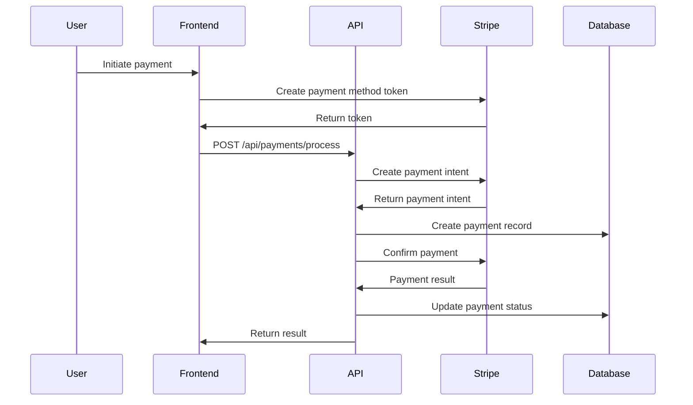
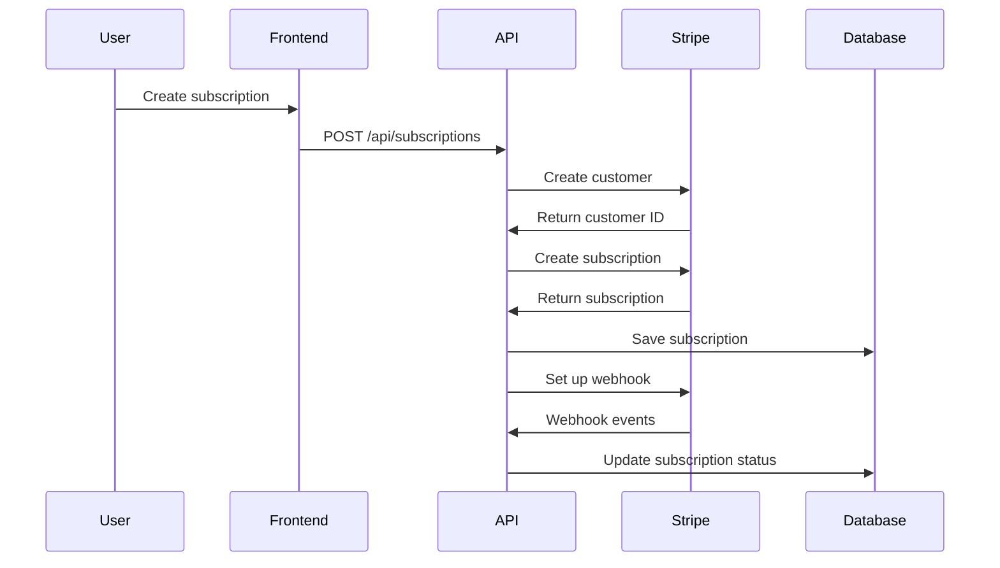

# Payment Processing Documentation

## Stripe Integration Overview

This document outlines the payment processing implementation using Stripe for handling credit cards, ACH payments, and subscription billing.

## Payment Processing Flow

### One-Time Payment Flow



### Subscription Payment Flow



## Stripe Configuration

### API Keys
- **Test Mode**: `sk_test_...` and `pk_test_...`
- **Live Mode**: `sk_live_...` and `pk_live_...`
- **Webhook Secrets**: Different secrets for test and live environments

### Supported Payment Methods
- **Credit/Debit Cards**: Visa, MasterCard, American Express, Discover
- **ACH Bank Transfers**: US bank accounts
- **Digital Wallets**: Apple Pay, Google Pay (future enhancement)

## Payment Method Management

### Adding Payment Methods

#### Frontend Implementation
```typescript
// Card payment method
const { error } = await stripe.confirmCardSetup(clientSecret, {
  payment_method: {
    card: cardElement,
    billing_details: {
      name: 'John Doe',
      email: 'john@example.com'
    }
  }
});

// ACH payment method
const { error } = await stripe.confirmUsBankAccountSetup(clientSecret, {
  payment_method: {
    us_bank_account: {
      routing_number: '110000000',
      account_number: '000123456789',
      account_holder_type: 'individual'
    },
    billing_details: {
      name: 'John Doe',
      email: 'john@example.com'
    }
  }
});
```

#### Backend Implementation
```csharp
public async Task<string> AddPaymentMethodAsync(string customerId, string paymentMethodToken, PaymentMethodType type)
{
    var paymentMethodService = new PaymentMethodService();
    var paymentMethod = await paymentMethodService.CreateAsync(new PaymentMethodCreateOptions
    {
        Type = type == PaymentMethodType.Card ? "card" : "us_bank_account",
        Card = new PaymentMethodCardOptions { Token = paymentMethodToken },
        UsBankAccount = new PaymentMethodUsBankAccountOptions 
        { 
            AccountHolderType = "individual", 
            AccountType = "checking",
            RoutingNumber = "110000000",
            AccountNumber = "000123456789"
        }
    });

    var attachOptions = new PaymentMethodAttachOptions
    {
        Customer = customerId,
    };
    await paymentMethodService.AttachAsync(paymentMethod.Id, attachOptions);
    return paymentMethod.Id;
}
```

### Payment Method Storage
- **Stripe Customer ID**: Links payment methods to customers
- **Payment Method ID**: Stripe's unique identifier
- **Last 4 Digits**: For display purposes
- **Payment Method Type**: Card, ACH, etc.
- **Is Default**: Primary payment method flag

## Payment Processing

### One-Time Payments

#### Payment Intent Creation
```csharp
public async Task<string> ProcessOneTimePaymentAsync(string customerId, string paymentMethodId, Money amount, string description)
{
    var options = new PaymentIntentCreateOptions
    {
        Amount = (long)(amount.Amount * 100), // Stripe expects amount in cents
        Currency = amount.Currency,
        Customer = customerId,
        PaymentMethod = paymentMethodId,
        ConfirmationMethod = "manual",
        Confirm = true,
        Description = description,
        OffSession = true
    };
    
    var service = new PaymentIntentService();
    var paymentIntent = await service.CreateAsync(options);
    return paymentIntent.Id;
}
```

#### Payment Status Handling
- **Pending**: Payment initiated but not yet processed
- **Processing**: Payment being processed by Stripe
- **Succeeded**: Payment completed successfully
- **Failed**: Payment failed (insufficient funds, declined, etc.)
- **Cancelled**: Payment cancelled by user or system
- **Refunded**: Payment refunded to customer

### Subscription Billing

#### Subscription Creation
```csharp
public async Task<string> CreateSubscriptionAsync(string customerId, string priceId, string paymentMethodId)
{
    var options = new SubscriptionCreateOptions
    {
        Customer = customerId,
        DefaultPaymentMethod = paymentMethodId,
        Items = new List<SubscriptionItemOptions>
        {
            new SubscriptionItemOptions { Price = priceId }
        },
        CollectionMethod = "charge_automatically"
    };
    
    var service = new SubscriptionService();
    var subscription = await service.CreateAsync(options);
    return subscription.Id;
}
```

#### Subscription Status Management
- **Incomplete**: Subscription created but payment failed
- **Incomplete Expired**: Subscription expired due to failed payment
- **Trialing**: Subscription in trial period
- **Active**: Subscription active and billing
- **Past Due**: Payment failed, retrying
- **Canceled**: Subscription cancelled
- **Unpaid**: Payment failed, subscription paused

## Webhook Handling

### Stripe Webhook Events

#### Payment Events
- `payment_intent.succeeded`: Payment completed successfully
- `payment_intent.payment_failed`: Payment failed
- `payment_method.attached`: Payment method added to customer
- `payment_method.detached`: Payment method removed from customer

#### Subscription Events
- `customer.subscription.created`: New subscription created
- `customer.subscription.updated`: Subscription modified
- `customer.subscription.deleted`: Subscription cancelled
- `invoice.payment_succeeded`: Subscription payment succeeded
- `invoice.payment_failed`: Subscription payment failed

### Webhook Implementation
```csharp
[HttpPost("webhooks/stripe")]
public async Task<IActionResult> HandleStripeWebhook()
{
    var json = await new StreamReader(HttpContext.Request.Body).ReadToEndAsync();
    var stripeEvent = EventUtility.ParseEvent(json);
    
    switch (stripeEvent.Type)
    {
        case Events.PaymentIntentSucceeded:
            await HandlePaymentSucceeded(stripeEvent);
            break;
        case Events.PaymentIntentPaymentFailed:
            await HandlePaymentFailed(stripeEvent);
            break;
        case Events.CustomerSubscriptionUpdated:
            await HandleSubscriptionUpdated(stripeEvent);
            break;
    }
    
    return Ok();
}
```

## Error Handling

### Common Payment Errors

#### Card Errors
- **Card Declined**: Insufficient funds or card blocked
- **Incorrect CVC**: Invalid security code
- **Expired Card**: Card expiration date passed
- **Insufficient Funds**: Account balance too low

#### ACH Errors
- **Invalid Account**: Account number or routing number incorrect
- **Account Closed**: Bank account no longer active
- **Insufficient Funds**: Bank account balance too low
- **Bank Rejection**: Bank rejected the transaction

### Error Response Format
```json
{
  "error": "payment_failed",
  "message": "Payment could not be processed",
  "details": {
    "code": "card_declined",
    "decline_code": "insufficient_funds",
    "stripe_error": "Your card has insufficient funds."
  }
}
```

## Security Considerations

### PCI Compliance
- Never store card details in our database
- Use Stripe's secure tokenization
- Implement proper access controls
- Regular security audits

### Data Protection
- Encrypt sensitive data in transit and at rest
- Implement proper authentication and authorization
- Log security events for monitoring
- Regular backup and recovery procedures

### Fraud Prevention
- Implement velocity checks
- Monitor for suspicious patterns
- Use Stripe's fraud detection tools
- Implement manual review processes

## Testing Strategy

### Unit Tests
- Payment service mocking
- Error handling scenarios
- Webhook event processing
- Payment method validation

### Integration Tests
- Stripe API integration
- Webhook endpoint testing
- Payment flow validation
- Error scenario testing

### End-to-End Tests
- Complete payment flows
- Subscription management
- Payment method management
- Error handling validation

## Monitoring and Analytics

### Key Metrics
- Payment success rates
- Average payment amount
- Payment method distribution
- Subscription churn rates
- Revenue metrics

### Alerting
- Failed payment rate thresholds
- Webhook delivery failures
- API error rate increases
- Unusual payment patterns

### Dashboards
- Real-time payment monitoring
- Revenue tracking
- Customer payment behavior
- System health metrics

## Best Practices

### Development
- Use test mode for development
- Implement proper error handling
- Test webhook endpoints locally
- Use idempotency keys

### Production
- Monitor payment success rates
- Implement proper logging
- Set up alerting for failures
- Regular security reviews

### Customer Experience
- Provide clear error messages
- Implement retry mechanisms
- Offer multiple payment methods
- Transparent pricing and fees
